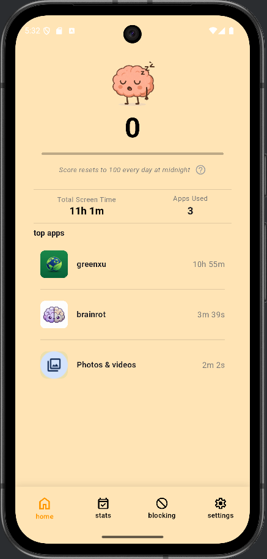
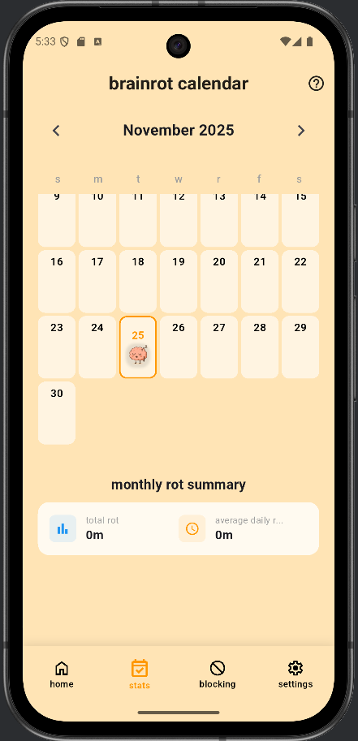
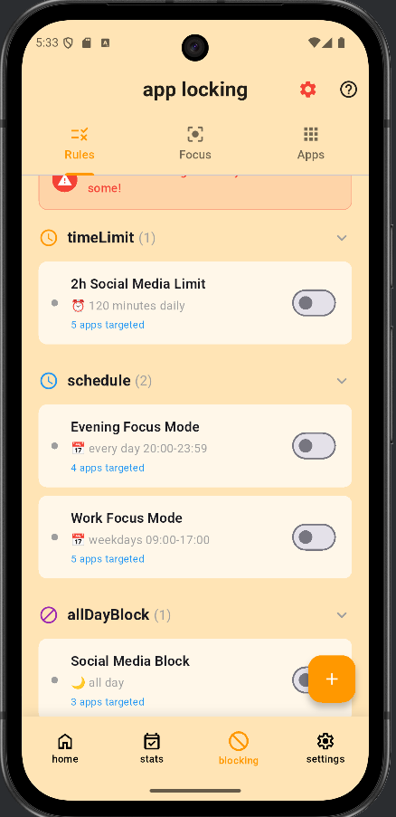
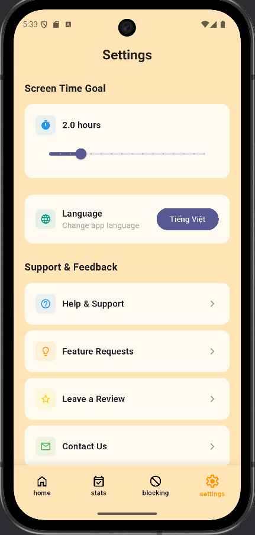

# 🧠 Brainrot - Digital Wellbeing & App Blocking

<div align="center">
  

[](https://flutter.dev)
[](https://www.android.com)
[](LICENSE)
</div>

## ✨ Features

<p align="center" style="display: flex; flex-wrap: wrap; justify-content: center; gap: 20px; padding: 20px; background-color: #f8f9fa; border-radius: 10px; margin: 20px 0;">
  
  
  
  
</p>

## 📱 Giới Thiệu

**Brainrot** là ứng dụng quản lý thời gian sử dụng điện thoại và chặn ứng dụng gây mất tập trung. Giúp bạn kiểm soát thói quen sử dụng smartphone, tăng năng suất làm việc và cải thiện sức khỏe tinh thần.

## ✨ Tính Năng Chính

### � **App Usage Tracking**
- Theo dõi thời gian sử dụng từng ứng dụng
- Thống kê theo ngày, tuần, tháng
- Biểu đồ trực quan và dễ hiểu
- Xem lịch sử sử dụng chi tiết

### � **App Blocking**
- **⏰ Time Limits**: Giới hạn thời gian sử dụng hàng ngày/phiên
- **📅 Schedule Blocking**: Chặn theo lịch trình (giờ, ngày trong tuần)
- **🌙 All Day Block**: Chặn cả ngày
- **🎯 Focus Modes**: Chế độ tập trung với whitelist/blacklist

### � **Advanced Blocking Features**
- Accessibility Service để phát hiện app đang mở
- Block overlay screen khi mở app bị chặn
- Emergency bypass cho trường hợp khẩn cấp
- Auto-start service sau khi reboot
- Foreground service chạy background 24/7

### 📈 **Analytics & Insights**
- Daily screen time goal tracking
- App usage statistics
- Productivity insights
- Usage trends và patterns

## 🛠 Công Nghệ Sử Dụng

### Flutter (Dart)
- **State Management**: Provider
- **Routing**: GoRouter
- **Local Storage**: SharedPreferences
- **UI**: Material Design 3

### Android Native (Kotlin)
- **Accessibility Service**: Phát hiện app đang mở
- **Foreground Service**: Background monitoring
- **Usage Stats API**: Tracking app usage
- **Overlay Permission**: Hiển thị block screen
- **Boot Receiver**: Auto-start service

## 🚀 Bắt Đầu

### Yêu Cầu Hệ Thống

- Flutter SDK 3.7.0 trở lên
- Dart SDK 3.0.0 trở lên
- Android Studio / VS Code
- Android 6.0 (API 23) trở lên

### Cài Đặt

1. Clone repository:
```bash
git clone https://github.com/your-username/brainrot.git
```

2. Di chuyển vào thư mục dự án:
```bash
cd brainrot
```

3. Cài đặt dependencies:
```bash
flutter pub get
```

4. Chạy ứng dụng:
```bash
flutter run
```

### Setup Permissions (Trên thiết bị)

1. **Usage Stats Permission**:
   - Settings > Apps > Special app access > Usage access
   - Enable cho Brainrot

2. **Display over other apps**:
   - Settings > Apps > Special app access > Display over other apps
   - Enable cho Brainrot

3. **Accessibility Service**:
   - Settings > Accessibility > Brainrot
   - Turn on service

4. **Battery Optimization** (Optional):
   - Settings > Battery > Battery Optimization
   - Select "Don't optimize" cho Brainrot

## 🏗️ Kiến Trúc

```
lib/
├── core/
│   ├── routes/          # App routing (GoRouter)
│   └── themes/          # App themes
├── data/
│   ├── model/           # Data models
│   └── services/        # Business logic services
│       ├── app_blocking_service.dart
│       ├── app_usage_service.dart
│       └── permission_service.dart
├── view/
│   ├── screens/         # UI screens
│   └── widgets/         # Reusable widgets
└── view_model/          # State management (Provider)

android/app/src/main/kotlin/
└── com/example/brainrot/
    ├── MainActivity.kt              # MethodChannel bridge
    ├── AppBlockingService.kt        # Background service
    ├── AppDetectionService.kt       # Accessibility service
    ├── BlockOverlayActivity.kt      # Block screen
    └── BootReceiver.kt              # Auto-start receiver
```

## 🔧 Cách Hoạt Động

1. **User tạo blocking rule** trong Flutter app
2. Rule được lưu vào SharedPreferences (`flutter.blocking_rules`)
3. **AppDetectionService** (Accessibility) phát hiện app được mở
4. Service đọc rules từ SharedPreferences
5. Nếu app bị block → hiển thị **BlockOverlayActivity**
6. User bị đưa về home screen

## 📊 Data Flow

```
Flutter App (UI)
    ↓ (save rules)
SharedPreferences
    ↓ (read rules)
Android Native Service
    ↓ (detect app open)
Accessibility Service
    ↓ (check rules)
Block/Allow Decision
    ↓ (if blocked)
Show Block Screen
```

## � Known Issues

- Accessibility Service cần user enable thủ công
- Android 10+ có thể kill service nếu không tắt battery optimization
- Một số launcher có thể bypass blocking

## 🔮 Future Features

- [ ] iOS support
- [ ] Cloud sync blocking rules
- [ ] Weekly/Monthly reports
- [ ] Gamification (streaks, achievements)
- [ ] Parental control mode
- [ ] Website blocking
- [ ] Smart suggestions based on usage patterns

## 🤝 Đóng Góp

Mọi đóng góp đều được hoan nghênh! Hãy tạo pull request hoặc issue.

## 📄 Giấy Phép

Dự án này được cấp phép theo giấy phép MIT - xem file [LICENSE](LICENSE) để biết thêm chi tiết.

## 📞 Liên Hệ

- Email: nguyenthanhtrungtt20@gmail.com

---

<div align="center">
  Made with ❤️ and ☕ for better digital wellbeing
</div>